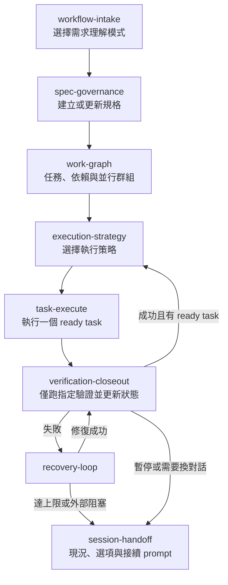

# AI Development Guide

本文件是 Algorithm Learning 專案的 agent 工作守則。它把 Spec-Driven Development（SDD）、harness、受限 loop 與 graph engineering 結合成可被單一 agent 或多 agent 使用的流程。

## 新手與重新開始

以下是任何採用本 workflow 的專案都適用的新對話起手式。先進入正確 repository，再貼上此 prompt：

```text
請先讀取此 repository 的 AGENTS.md、AI development workflow guide、現有 spec/plan/tasks、工作圖與 progress 檔案。
若專案有 framework 或領域守則，也讀取其 agent 入口與本任務適用的詳細文件。

使用 $session-handoff 確認目前狀態；如果沒有既有工作，使用 $workflow-intake 處理以下需求：
<貼上需求>

先建立或更新至少一份完整 spec。開始實作前，建立或更新 plan、tasks 與 dependency graph；每次只執行一個 ready task，並依 task 合約更新進度與推薦下一步。
```

本專案的 project-specific prompt 如下；涉及客戶端實作時，它額外指定 Compose
開發守則：

```text
請使用本專案的 agent workflow 開始或恢復工作。

第一步完整閱讀：
- AGENTS.md
- AI_DEVELOPMENT_GUIDE.md
- apps/multiplatform/COMPOSE_GUIDE.md（僅客戶端實作任務）
- agent-workflow/WORK_GRAPH.yaml
- agent-workflow/progress.md

先使用 $session-handoff 確認現況；沒有既有功能工件時，使用 $workflow-intake 分析以下需求：
<貼上需求>
```

接著依序執行：

1. `workflow-intake`：選擇 `grill-me`、`brainstorm` 或 `quick-analysis`，並建立／更新 `spec.md`。
2. `spec-governance`：選擇模糊需求由 `infer` 自行判定，或以 `ask-with-options` 提供推薦方案讓使用者決定。
3. `work-graph`：建立 `plan.md`、`tasks.md`、工作圖與可並行群組。
4. `execution-strategy`：為一個 ready task 選擇 agent、測試、文件與模糊需求策略。
5. `task-execute`：執行 task；再用 `verification-closeout` 更新狀態與推薦下一個節點。
6. 失敗時使用 `recovery-loop`；暫停、換對話或要查下一步時使用 `session-handoff`。

若使用者明確要求直接完成整個 task，`task-execute` 必須連續執行至
closeout、recovery 終止或真正外部 blocker；不得以局部 UI slice 或中間測試
通過作為回覆邊界。

每個 task 在首次修改前，必須把 deliverable、spec refs 與 acceptance criteria
轉成 completion checklist。除非 checklist 全部完成並已跑 task 限定驗證，否則
不得回覆局部進度或要求下一次指令；可由現有規格推得的工作不是 blocker。

Closeout compares `tasks.md` Phase headings. A next ready task in a different
Phase is a mandatory new-conversation handoff: output the complete prompt from
`WORKFLOW_CONTINUATION.md`, rather than a same-conversation `$execution-strategy`
command.

若介面未自動顯示 project-local skills，直接在 prompt 指定 `$技能名稱`，並要求 agent 讀取 `agent-skills/<技能名稱>/SKILL.md`。所有 agent 都必須先讀根目錄 `AGENTS.md`。

每個 skill 結束時都會依 [Workflow Continuation Contract](agent-skills/WORKFLOW_CONTINUATION.md) 以 workflow phase 為界自動選擇「留在本對話」或「開新對話」其中一種續作方式；不得同時輸出兩者，也不得要求使用者選擇對話路徑。即使該 skill 已完成、被阻塞或本身是 `session-handoff` 也不例外。

## 不可省略的 preflight

每次執行前，依序閱讀：

1. `AGENTS.md`
2. 客戶端實作任務讀取 `apps/multiplatform/COMPOSE_GUIDE.md` 的適用章節
3. 功能已存在的完整 `spec.md`、`plan.md`、`tasks.md`；建立工件的 workflow 階段須明確記錄尚未存在者
4. `agent-workflow/WORK_GRAPH.yaml` 的已存在 task 節點與 `agent-workflow/progress.md`

Compose guide 是客戶端程式架構的權威；本文件只治理 agent 如何分析、規劃、執行與交接。

## 四個工程概念

| 概念 | 在本專案的落地方式 |
|---|---|
| SDD | 每項功能以 `spec.md → plan.md → tasks.md → implementation` 建立可追溯工件。|
| Harness | `AGENTS.md`、Compose guide、skills、工作圖與 progress 都在 repository，可讀、可改、可驗證。|
| Loop | 驗證失敗時採 `max-3-healing` 或 `force-once`，有明確終止條件。|
| Graph engineering | `WORK_GRAPH.yaml` 是 task 狀態與依賴的來源真相；Mermaid 是可讀視圖。|

## 工作流圖



## Skills

| Skill | 用途 | 何時使用 | 可選抉擇點 | 下一步 |
|---|---|---|---|---|
| `workflow-intake` | 理解需求並啟動 SDD | 新需求或需求改變 | `grill-me` / `brainstorm` / `quick-analysis` | `spec-governance` |
| `spec-governance` | 維護詳細且可實作的規格 | 要建立、修正或確認 spec | `update-docs` / `direct-development`；`infer` / `ask-with-options` | `work-graph` |
| `work-graph` | 拆任務與決定依賴 | spec 已可執行 | `single-agent` / `three-perspectives` | `execution-strategy` |
| `execution-strategy` | 固定 task 的執行合約 | 開始一個 ready task 前 | `single-agent` / `three-perspectives`；`rapid` / `test-candidates` / `tdd`；`update-docs` / `direct-development`；`infer` / `ask-with-options` | `task-execute` |
| `task-execute` | 對完整 spec 與 task 做實作 | task 已 ready 且策略已選 | 沿用該 task 的 execution contract | `verification-closeout` |
| `verification-closeout` | 用指定驗證關閉 task | task 實作後 | `pass` / `needs-recovery` / `blocked` | 下一個 ready task 或 `recovery-loop` |
| `recovery-loop` | 有界的失敗修復 | 指定驗證失敗 | `max-3-healing` / `force-once` | `verification-closeout` 或 `session-handoff` |
| `session-handoff` | 交接、恢復與下一步推薦 | 每個 task 後、暫停時或單獨查進度 | `same-session` / `new-session` | 指定下一個 skill |

## 每個 skill 的行為摘要

- `workflow-intake`：先選理解深度；輸出需求邊界、成功條件與至少一份規格檔。
- `spec-governance`：確保 spec 為詳細來源真相；模糊處可由 AI 記錄假設，或提出含推薦方案的選項。
- `work-graph`：所有 task 都有 `depends_on`、`parallel_group`、`spec_refs` 與 `verification`。
- `execution-strategy`：在改程式前記錄本 task 的 agent、測試、文件與決策方式，避免中途漂移。
- `task-execute`：每次只實作一個 ready task；必讀完整細節與現行守則。
- `verification-closeout`：只執行 task 已定義的驗證；通過後更新狀態、提交並推薦下一個節點。
- `recovery-loop`：失敗都留下診斷與證據；達終止條件時交給使用者選擇，不假裝完成。
- `session-handoff`：可被其他 skill 在結尾建議，也可獨立呼叫作為恢復入口。

## 何時用單一 agent 或三個視角

預設使用單一 agent。高風險、跨 client/API/DB、規格歧義高或架構變更時，使用三個視角：planner 定義路徑、implementer 提出最小變更、evaluator 對照 spec 與 task 合約。三者是分析視角，不授權額外修改或額外驗證。

## 工作圖與跨對話恢復

`agent-workflow/WORK_GRAPH.yaml` 是狀態來源真相；每個 task 的 `status` 只能是 `pending`、`ready`、`in_progress`、`blocked`、`completed`。只有所有 `depends_on` 都完成的 task 才能為 `ready`。`progress.md` 記錄最近一次工作的證據與下一步。

新對話一律先使用 `$session-handoff`，它會從持久化工件恢復狀態並產生下一步 prompt；不要只用舊對話摘要作為實作依據。

## 驗證與完成規則

只執行 `tasks.md` 和 `WORK_GRAPH.yaml` 該 task `verification` 欄位明定的命令。成功後更新 `tasks.md`、`WORK_GRAPH.yaml`、`progress.md`，完成提交並主動通知。除非 task 明定，完成後不疊加 review、也不重跑其他檢查。

## 參考來源

- [GitHub Spec Kit：Spec-Driven Development](https://github.github.com/spec-kit/)
- [OpenAI：Harness engineering](https://openai.com/index/harness-engineering/)
- [Anthropic：Trustworthy agents and loops](https://www.anthropic.com/research/trustworthy-agents)
- [Agent Graph：可恢復工作圖](https://github.com/context4ai/agent-graph)
