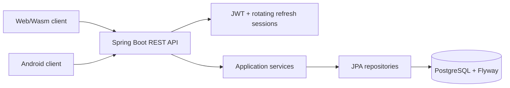
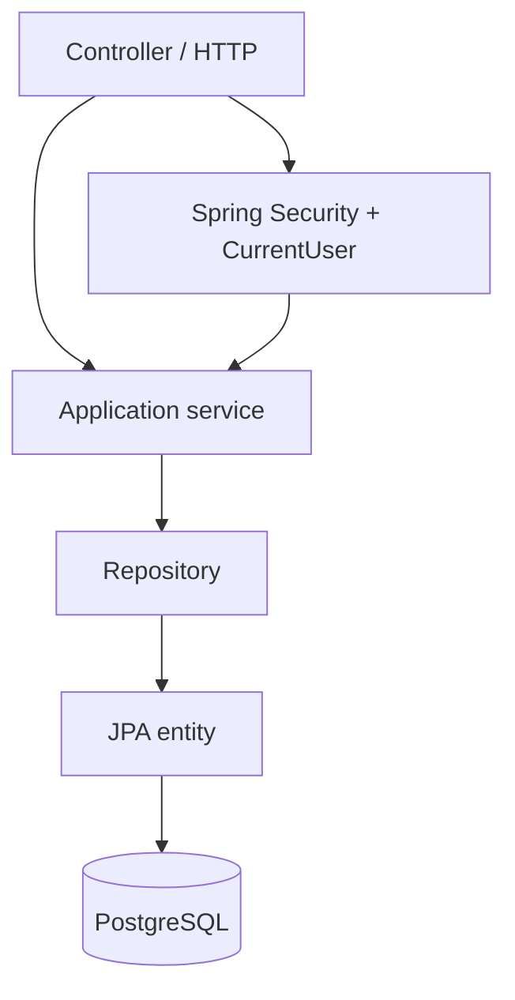
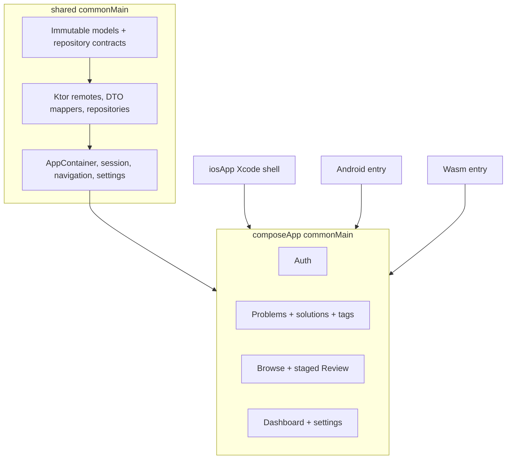
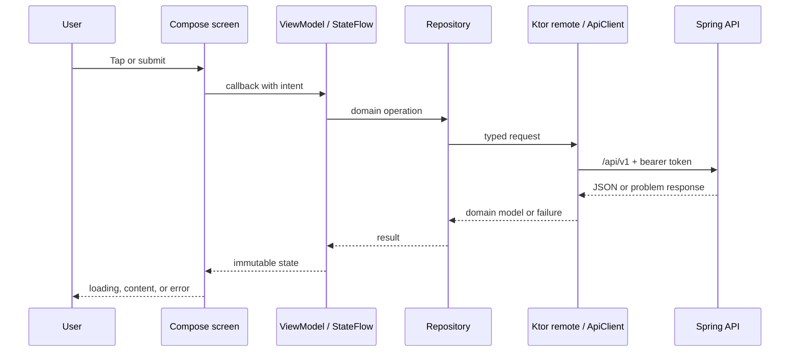
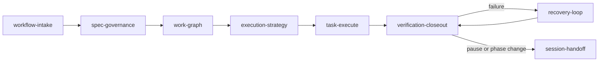

# Algorithm Learning

[繁體中文](README.zh-TW.md) · A cross-platform workspace for recording algorithm problems, solutions, and review progress.

## Overview

Algorithm Learning combines a Java/Spring Boot REST API, PostgreSQL, and a Kotlin Compose Multiplatform client. Web/Wasm is the primary management experience; Android is a source-built demonstration; iOS is a Simulator-oriented shell. The product is personal-first, while every product record remains owner-scoped for future multi-user use.

## Features

- Account registration, sign-in, secure refresh, and sign-out.
- Problem library CRUD with full-text search, filters, tags, and independent solutions.
- Ordered Review Mode with confidence scoring and server-derived next-review dates.
- Dashboard totals, difficulty counts, and due-review count.

## Architecture



## Quick start

### Prerequisites

- JDK 21 for the API; JDK 17+ for Compose.
- Docker Desktop and Docker Compose for the local API/database stack.
- Android SDK only to assemble Android.

Create the ignored local configuration file and replace all placeholders; never commit it.

```sh
cp infra/env/.env.example infra/env/.env
docker compose -f infra/compose.yaml up -d --build
docker compose -f infra/compose.yaml ps
curl --fail http://localhost:8080/actuator/health/readiness
```

The API runs at `http://localhost:8080`. Stop services while retaining local data:

```sh
docker compose -f infra/compose.yaml down
```

`docker compose ... down --volumes` permanently deletes the Compose-managed database volume.

### Client commands

```sh
cd apps/multiplatform
./gradlew :shared:allTests
./gradlew :composeApp:assembleDebug
./gradlew :composeApp:wasmJsBrowserDevelopmentRun
```

For Android source-build/install instructions, read [ANDROID_RELEASE.md](apps/multiplatform/ANDROID_RELEASE.md). For the iOS Simulator shell, read [iosApp/README.md](apps/multiplatform/iosApp/README.md).

## Backend: Java and Spring Boot

The API under `services/api` is a modular monolith. Feature packages own transport, application, and persistence responsibilities. Controllers remain thin; services own transactions and authorization; JPA entities never become client-facing models.



| Area | Responsibility |
|---|---|
| `auth` | Argon2id password handling, access JWTs, opaque refresh rotation, current user. |
| `problems`, `solutions`, `tags` | Owner-scoped library CRUD and validation. |
| `reviews` | Append-only review events and next-review derivation. |
| `dashboard` | Owner-scoped aggregate counts. |
| `db/migration` | Ordered Flyway migrations before Hibernate schema validation. |

Docker Compose starts `postgres:16-alpine` on an isolated network, waits for it to become healthy, builds the API, publishes port `8080`, and probes `/actuator/health/readiness`. See [infra/README.md](infra/README.md) and [infra/env/.env.example](infra/env/.env.example).

## Database tables

Flyway owns the schema. All IDs are UUIDs and timestamps use `timestamptz`.

| Table | Fields and purpose |
|---|---|
| `users` | `id`, unique case-insensitive `email`, `password_hash`, `created_at`, `updated_at`: account identity. |
| `auth_sessions` | `id`, `user_id`, unique `token_hash`, `expires_at`, `revoked_at`, `created_at`, `last_used_at`: hashed refresh-session state. |
| `problems` | `id`, `user_id`, `title`, `platform`, `external_problem_id`, `external_url`, `difficulty`, `description`, `notes`, `key_insight`, `time_complexity`, `space_complexity`, `mistakes`, `interview_notes`, timestamps: learning record. |
| `solutions` | `id`, `problem_id`, `language`, `code`, `explanation`, timestamps: independent solution; code or explanation is required. |
| `tags` | `id`, `user_id`, `name`, owner-unique `normalized_name`, timestamps: normalized labels. |
| `problem_tags` | `problem_id`, `tag_id`: many-to-many join with composite primary key. |
| `reviews` | `id`, `problem_id`, `confidence` (0–4), `reviewed_at`, `next_review_at`, `notes`, `policy_version`: immutable history. Adaptive rows also retain `previous_interval_days`, `previous_ease_factor`, `interval_days`, `ease_factor`, `repetitions`. |

`problems` has owner/date, difficulty, platform, external-ID, and GIN full-text indexes. `reviews` has due-date and history indexes. `adaptive-v1` requires an interval, ease factor (1.30–3.00), and repetitions.

## REST API

All product routes are under `/api/v1`; authenticated product data is scoped to the JWT current user.

| Method | Route | Purpose |
|---|---|---|
| `POST` | `/auth/register` | Create account and session. |
| `POST` | `/auth/login` | Authenticate and establish a session. |
| `POST` | `/auth/refresh` | Rotate refresh state and issue access token. |
| `POST` | `/auth/logout` | Revoke/expire current refresh session. |
| `GET` | `/auth/me` | Return signed-in user. |
| `GET`, `POST` | `/problems` | List/search/filter or create problems. |
| `GET`, `PUT`, `DELETE` | `/problems/{id}` | Read, replace, or delete one owned problem. |
| `GET`, `POST` | `/problems/{problemId}/solutions` | List or add solutions. |
| `PUT`, `DELETE` | `/solutions/{id}` | Replace or delete a solution. |
| `GET`, `POST` | `/tags` | List tags or create/get normalized tag. |
| `POST` | `/reviews` | Append a review event. |
| `GET` | `/reviews/today` | List due reviews. |
| `GET` | `/reviews/history?problemId={uuid}` | Return one problem’s history. |
| `GET` | `/dashboard` | Return total, easy, medium, hard, and due-review count. |

Health probes are `/actuator/health/liveness` and `/actuator/health/readiness`.

## Client: Compose Multiplatform

The active client is `apps/multiplatform`, sharing Kotlin code across Android and Web/Wasm. Domain/data/state are separate from Compose rendering so platform code stays thin and testable.



| Choice | Reason |
|---|---|
| Compose Multiplatform | Shared UI/state for Android and Web, with an iOS Simulator shell. |
| `commonMain` | Platform-neutral domain, contracts, localization, navigation, and state. |
| Ktor + kotlinx serialization | Typed HTTP and DTO mapping isolated from UI. |
| `StateFlow` + immutable state | Predictable one-way updates and focused tests. |
| Manual `AppContainer` | Explicit dependency composition without a global locator. |
| Gradle version catalog | One pinned, auditable version source. |

### Important pages

- **Authentication:** register, sign in, restore session, sign out.
- **Problem library:** search/filter, list states, editor, detail, tags, and independent solutions.
- **Review:** Today’s due list and `Problem → Think → Hint → My Approach → Solution → Confidence`; confidence cannot be submitted early.
- **Dashboard/Home:** totals, difficulty counts, and due-review count.
- **Settings:** language and validated API-origin override.

### API-to-screen flow



`shared` owns in-memory tokens, single-flight refresh, endpoint settings, API clients, and mappings. `composeApp` owns view models and stateless screens. Composables receive state/callbacks, never repositories or HTTP clients. See [COMPOSE_GUIDE.md](apps/multiplatform/COMPOSE_GUIDE.md).

## User guide

1. **Register or sign in.** New users register; returning users sign in. Refresh cookies maintain sessions while access tokens remain in memory.
2. **Add a problem.** Enter title, platform, difficulty, optional external reference, summary, notes, insight, complexity, mistakes, and interview notes.
3. **Tag and solve.** Select/create normalized tags and add independent solutions with language, code, and explanation.
4. **Find records.** Use search/filters, open detail, then update records or manage solutions.
5. **Review.** Open Review, choose a due problem, reveal stages in order, select confidence 0–4 after solution disclosure, add an optional note, and submit. The API derives the next due date.
6. **Read progress.** Dashboard shows totals, difficulty distribution, and due count.
7. **Configure client.** Settings changes language or validated API origin. Changing origin creates a fresh client/auth stack, so sign in again.

## AI development workflow

Written artifacts are the agent control plane: `spec.md` defines the outcome, `plan.md` explains delivery order, `tasks.md` makes work executable, `agent-workflow/WORK_GRAPH.yaml` is the task/dependency source of truth, and `progress.md` stores resume evidence.



| Skill | When to use it | Result |
|---|---|---|
| `workflow-intake` | New/changed request. | Chooses analysis depth and creates/updates the feature spec. |
| `spec-governance` | Spec needs decisions or consistency checks. | Records documentation and ambiguity decisions. |
| `work-graph` | Executable spec needs task breakdown. | Produces plan/tasks and dependency graph. |
| `execution-strategy` | A ready task is about to start. | Fixes analysis, test, documentation, and ambiguity contract. |
| `task-execute` | Task has a contract. | Implements exactly one task and completion checklist. |
| `verification-closeout` | Implementation is ready. | Runs only task-listed verification and records closeout. |
| `recovery-loop` | Contract verification fails. | Diagnoses and repairs within a bounded retry policy. |
| `session-handoff` | Pause, resume, or phase change. | Reconstructs persisted state and gives exact next action. |

| Situation | Start with | Why |
|---|---|---|
| New feature/change | `workflow-intake` | Establish scope before code. |
| Ambiguous requirement | `workflow-intake` → `spec-governance` | Record inference or obtain the one material decision. |
| Approved spec without tasks | `work-graph` | Establish dependencies and verification. |
| Ready task | `execution-strategy` | Prevent mid-task policy drift. |
| Test/verification fails | `recovery-loop` | Preserve diagnosis and bound retries. |
| New chat/interruption | `session-handoff` | Resume from graph and progress. |
| Task is implemented | `verification-closeout` | Close only after contract checks pass. |

## Verification, deployment, and security

- API: `cd services/api && ./mvnw -q verify`.
- Client: `cd apps/multiplatform && ./gradlew :shared:allTests`, `./gradlew :composeApp:allTests`, and `./gradlew :composeApp:assembleDebug`.
- Local operations: [infra/README.md](infra/README.md).
- Hosting/showcase: [infra/firebase/README.md](infra/firebase/README.md) and [infra/gcp/README.md](infra/gcp/README.md).
- Kubernetes target: [infra/kubernetes/README.md](infra/kubernetes/README.md).

Never commit `.env`, passwords, JWT/refresh-hash keys, keystores, or service-account credentials. Production uses secret references and workload identity; this repository contains names, templates, and runbooks rather than secret values.

## Repository map

```text
apps/multiplatform/   Compose client: shared domain/data/state and Compose UI
services/api/         Java/Spring Boot modular-monolith API
infra/                Docker, environment template, hosting/deployment docs
specs/                Product and delivery specifications
agent-workflow/       Task graph and durable progress evidence
agent-skills/         Project-local AI workflow skills
```

## Status

This is a completed portfolio/showcase project. Android is source-built and iOS is a Simulator demonstration. Review the linked operational guides before changing cloud resources or rotating credentials.
