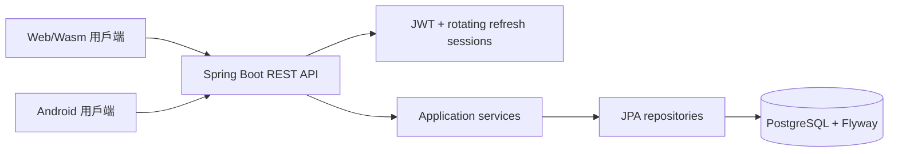
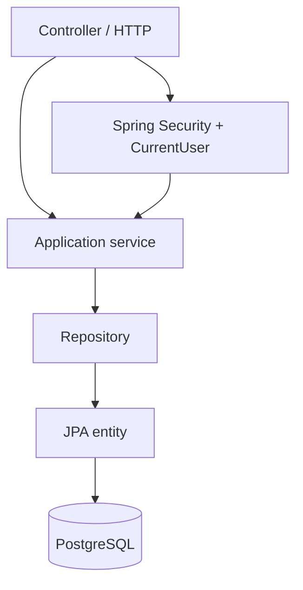
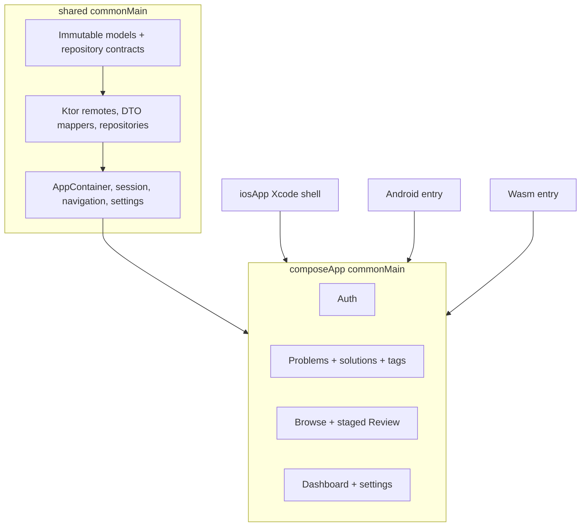
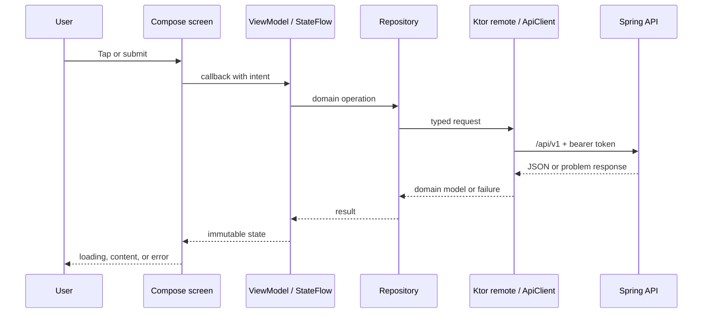
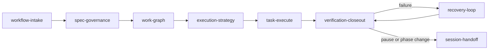

# Algorithm Learning

[English](README.md) · 用於記錄演算法題目、解法與複習進度的跨平台個人學習系統。

## 專案概覽

Algorithm Learning 結合 Java/Spring Boot REST API、PostgreSQL 與 Kotlin Compose Multiplatform 用戶端。Web/Wasm 是主要管理介面；Android 採原始碼建置展示；iOS 是以 Simulator 為主的 shell。產品以個人使用優先，但所有產品資料皆以擁有者範圍隔離，能延伸至多使用者情境。

## 功能

- 註冊、登入、安全 session 更新與登出。
- 題目 CRUD、full-text search、篩選、標籤與獨立解法。
- 依順序揭露的 Review Mode、熟悉度評分與伺服器推導的下次複習日期。
- 顯示總題數、難度分布與待複習數的 Dashboard。

## 系統架構



## 快速開始

### 前置需求

- API 使用 JDK 21；Compose 使用 JDK 17 以上。
- 本機 API/資料庫環境需要 Docker Desktop 與 Docker Compose。
- 僅建置 Android 時需要 Android SDK。

建立被忽略的本機設定檔，替換所有 placeholder；不得提交此檔案。

```sh
cp infra/env/.env.example infra/env/.env
docker compose -f infra/compose.yaml up -d --build
docker compose -f infra/compose.yaml ps
curl --fail http://localhost:8080/actuator/health/readiness
```

API 位於 `http://localhost:8080`。下列指令會停止服務並保留本機資料：

```sh
docker compose -f infra/compose.yaml down
```

`docker compose ... down --volumes` 會永久刪除 Compose 管理的資料庫 volume。

### 用戶端指令

```sh
cd apps/multiplatform
./gradlew :shared:allTests
./gradlew :composeApp:assembleDebug
./gradlew :composeApp:wasmJsBrowserDevelopmentRun
```

Android 原始碼建置／安裝請讀 [ANDROID_RELEASE.md](apps/multiplatform/ANDROID_RELEASE.md)；iOS Simulator shell 請讀 [iosApp/README.md](apps/multiplatform/iosApp/README.md)。

## 後端：Java 與 Spring Boot

API 位於 `services/api`，採模組化單體架構。feature package 擁有 transport、application 與 persistence 職責；controller 保持精簡，service 負責 transaction 與 authorization，JPA entity 不會直接成為用戶端模型。



| Area | 職責 |
|---|---|
| `auth` | Argon2id 密碼處理、access JWT、不透明 refresh rotation、目前使用者。 |
| `problems`, `solutions`, `tags` | 擁有者範圍的題庫 CRUD 與驗證。 |
| `reviews` | append-only 複習事件與 next-review 推導。 |
| `dashboard` | 擁有者範圍的 aggregate count。 |
| `db/migration` | Hibernate schema validation 前執行有順序的 Flyway migration。 |

Docker Compose 在隔離 network 中啟動 `postgres:16-alpine`，等待健康後建置 API、開放 `8080`，並檢查 `/actuator/health/readiness`。請見 [infra/README.md](infra/README.md) 與 [infra/env/.env.example](infra/env/.env.example)。

## 資料庫 table

Flyway 擁有 schema。所有 ID 都是 UUID，時間欄位使用 `timestamptz`。

| Table | 欄位與用途 |
|---|---|
| `users` | `id`、大小寫不敏感且唯一的 `email`、`password_hash`、`created_at`、`updated_at`：帳號識別。 |
| `auth_sessions` | `id`、`user_id`、唯一 `token_hash`、`expires_at`、`revoked_at`、`created_at`、`last_used_at`：雜湊 refresh-session 狀態。 |
| `problems` | `id`、`user_id`、`title`、`platform`、`external_problem_id`、`external_url`、`difficulty`、`description`、`notes`、`key_insight`、`time_complexity`、`space_complexity`、`mistakes`、`interview_notes`、timestamps：學習紀錄。 |
| `solutions` | `id`、`problem_id`、`language`、`code`、`explanation`、timestamps：獨立解法；必須有 code 或 explanation。 |
| `tags` | `id`、`user_id`、`name`、owner-unique `normalized_name`、timestamps：正規化標籤。 |
| `problem_tags` | `problem_id`、`tag_id`：以複合 primary key 建立的多對多關聯。 |
| `reviews` | `id`、`problem_id`、`confidence`（0–4）、`reviewed_at`、`next_review_at`、`notes`、`policy_version`：不可變歷史。adaptive row 另有 `previous_interval_days`、`previous_ease_factor`、`interval_days`、`ease_factor`、`repetitions`。 |

`problems` 建有 owner/date、difficulty、platform、external-ID 與 GIN full-text index；`reviews` 有 due-date 與 history index。`adaptive-v1` 需要 interval、1.30–3.00 的 ease factor 與 repetitions。

## REST API

所有產品路由都在 `/api/v1`；需要登入的產品資料依 JWT current user 限定範圍。

| Method | Route | 用途 |
|---|---|---|
| `POST` | `/auth/register` | 建立帳號與 session。 |
| `POST` | `/auth/login` | 驗證身分並建立 session。 |
| `POST` | `/auth/refresh` | 輪替 refresh state 並發出 access token。 |
| `POST` | `/auth/logout` | 撤銷／過期目前 refresh session。 |
| `GET` | `/auth/me` | 回傳登入使用者。 |
| `GET`, `POST` | `/problems` | list/search/filter 或新增題目。 |
| `GET`, `PUT`, `DELETE` | `/problems/{id}` | 讀取、完整更新或刪除一筆擁有的題目。 |
| `GET`, `POST` | `/problems/{problemId}/solutions` | 列出或新增解法。 |
| `PUT`, `DELETE` | `/solutions/{id}` | 完整更新或刪除解法。 |
| `GET`, `POST` | `/tags` | 列出標籤或建立／取得 normalized tag。 |
| `POST` | `/reviews` | 新增 review event。 |
| `GET` | `/reviews/today` | 列出到期 review。 |
| `GET` | `/reviews/history?problemId={uuid}` | 回傳單一題目的歷史。 |
| `GET` | `/dashboard` | 回傳 total、easy、medium、hard、due-review count。 |

健康檢查是 `/actuator/health/liveness` 與 `/actuator/health/readiness`。

## 前端：Compose Multiplatform

目前用戶端為 `apps/multiplatform`，Android 與 Web/Wasm 共用 Kotlin 程式碼。domain/data/state 與 Compose rendering 分離，使 platform code 簡潔且可測試。



| 選擇 | 理由 |
|---|---|
| Compose Multiplatform | Android/Web 共用 UI/state，並有 iOS Simulator shell。 |
| `commonMain` | domain、contract、localization、navigation、state 保持平台無關。 |
| Ktor + kotlinx serialization | 以 typed HTTP 和 DTO mapping 隔離 UI。 |
| `StateFlow` + immutable state | 可預測的單向更新與聚焦測試。 |
| Manual `AppContainer` | 明確 dependency composition，不用 global locator。 |
| Gradle version catalog | 單一、固定、可稽核的版本來源。 |

### 重要頁面

- **Authentication**：register、sign in、restore session、sign out。
- **Problem library**：search/filter、list state、editor、detail、tag 與獨立 solution。
- **Review**：Today’s due list 和 `Problem → Think → Hint → My Approach → Solution → Confidence`；不能提早送出 confidence。
- **Dashboard/Home**：total、difficulty count、due-review count。
- **Settings**：language 與已驗證 API-origin override。

### API 到畫面流程



`shared` 擁有 memory token、single-flight refresh、endpoint setting、API client 與 mapping；`composeApp` 擁有 view model 和 stateless screen。composable 只接收 state/callback，不接收 repository/HTTP client。請見 [COMPOSE_GUIDE.md](apps/multiplatform/COMPOSE_GUIDE.md)。

## 使用者操作手冊

1. **註冊或登入。** 新使用者 Register，既有使用者 Sign in。refresh cookie 維持 session，access token 僅在 memory。
2. **新增題目。** 填寫 title、platform、difficulty、選填 external reference、summary、note、insight、complexity、mistake、interview note。
3. **標籤與解法。** 選擇／建立 normalized tag，新增獨立 solution 的 language、code、explanation。
4. **尋找紀錄。** 使用 search/filter，開啟 detail 後更新紀錄或管理 solution。
5. **複習。** 進入 Review，選擇到期題目，依序揭露階段；solution 顯示後才可選 0–4 confidence，選填 note 後送出。API 會推導下次到期日。
6. **讀取進度。** Dashboard 顯示 total、difficulty distribution、due count。
7. **設定用戶端。** Settings 可變更 language 或已驗證 API origin；變更 origin 會建立新的 client/auth stack，因此需重新登入。

## AI 工作流

書面工件是 agent control plane：`spec.md` 定義結果、`plan.md` 說明交付順序、`tasks.md` 使工作可執行、`agent-workflow/WORK_GRAPH.yaml` 是 task/dependency 真相來源、`progress.md` 保存 resume evidence。



| Skill | 何時使用 | 結果 |
|---|---|---|
| `workflow-intake` | 新增／變更需求。 | 選擇分析深度，建立／更新 feature spec。 |
| `spec-governance` | spec 需要決策或一致性檢查。 | 記錄 documentation/ambiguity decision。 |
| `work-graph` | executable spec 需要 task breakdown。 | 產生 plan/tasks 與 dependency graph。 |
| `execution-strategy` | ready task 即將開始。 | 固定 analysis、test、documentation、ambiguity contract。 |
| `task-execute` | task 已有 contract。 | 只實作一個 task 與 completion checklist。 |
| `verification-closeout` | implementation 已準備好。 | 只執行 task-listed verification 並記錄 closeout。 |
| `recovery-loop` | contract verification 失敗。 | 在有界 retry policy 內診斷與修復。 |
| `session-handoff` | pause、resume、phase change。 | 重建 persisted state，給出下一個精確行動。 |

| 情境 | 從哪個 skill 開始 | 原因 |
|---|---|---|
| 新功能／需求變更 | `workflow-intake` | 在程式碼前先建立 scope。 |
| 模糊需求 | `workflow-intake` → `spec-governance` | 記錄推論或取得唯一重要決策。 |
| approved spec 尚未拆 task | `work-graph` | 建立 dependency 與 verification。 |
| ready task | `execution-strategy` | 避免中途 drift。 |
| test/verification 失敗 | `recovery-loop` | 保存診斷並限制 retry。 |
| 新對話／中斷 | `session-handoff` | 從 graph/progress 恢復。 |
| task 實作完成 | `verification-closeout` | 僅在 contract check 通過後關閉。 |

## 驗證、部署與安全

- API：`cd services/api && ./mvnw -q verify`。
- Client：`cd apps/multiplatform && ./gradlew :shared:allTests`、`./gradlew :composeApp:allTests`、`./gradlew :composeApp:assembleDebug`。
- 本機操作：[infra/README.md](infra/README.md)。
- Hosting/showcase：[infra/firebase/README.md](infra/firebase/README.md)、[infra/gcp/README.md](infra/gcp/README.md)。
- Kubernetes target：[infra/kubernetes/README.md](infra/kubernetes/README.md)。

不得提交 `.env`、password、JWT/refresh-hash key、keystore、service-account credential。Production 使用 secret reference 與 workload identity；repository 保存名稱、template、runbook，不保存 secret value。

## Repository map

```text
apps/multiplatform/   Compose client：shared domain/data/state 與 Compose UI
services/api/         Java/Spring Boot modular-monolith API
infra/                Docker、environment template、hosting/deployment 文件
specs/                Product 與 delivery specification
agent-workflow/       Task graph 與 durable progress evidence
agent-skills/         專案內 AI workflow skill
```

## 專案狀態

這是已完成的 portfolio/showcase 專案。Android 採 source-built，iOS 是 Simulator demonstration。變更 cloud resource 或 rotation credential 前，請先閱讀所連結的 operational guide。
