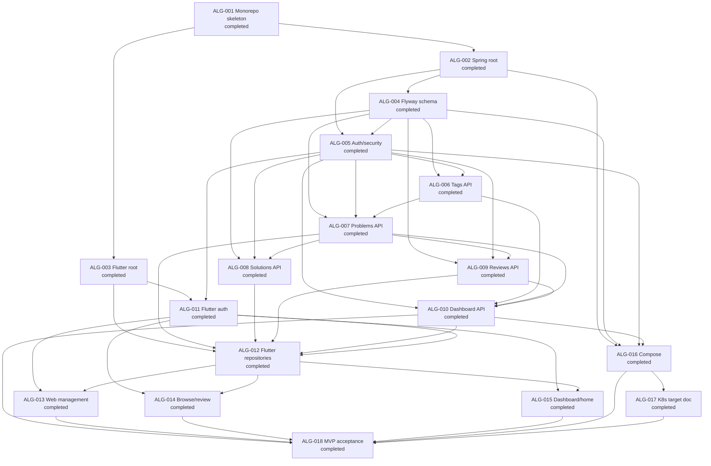
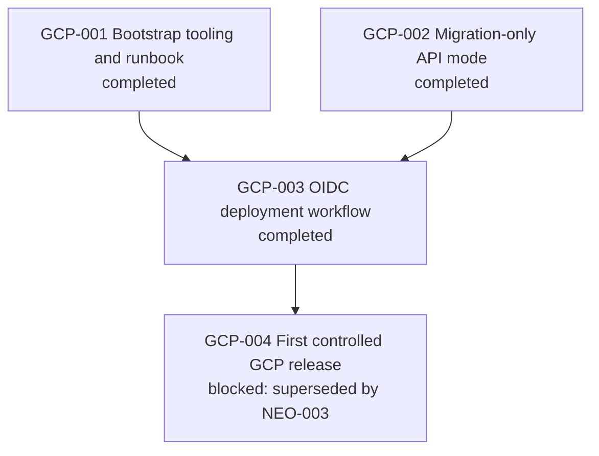
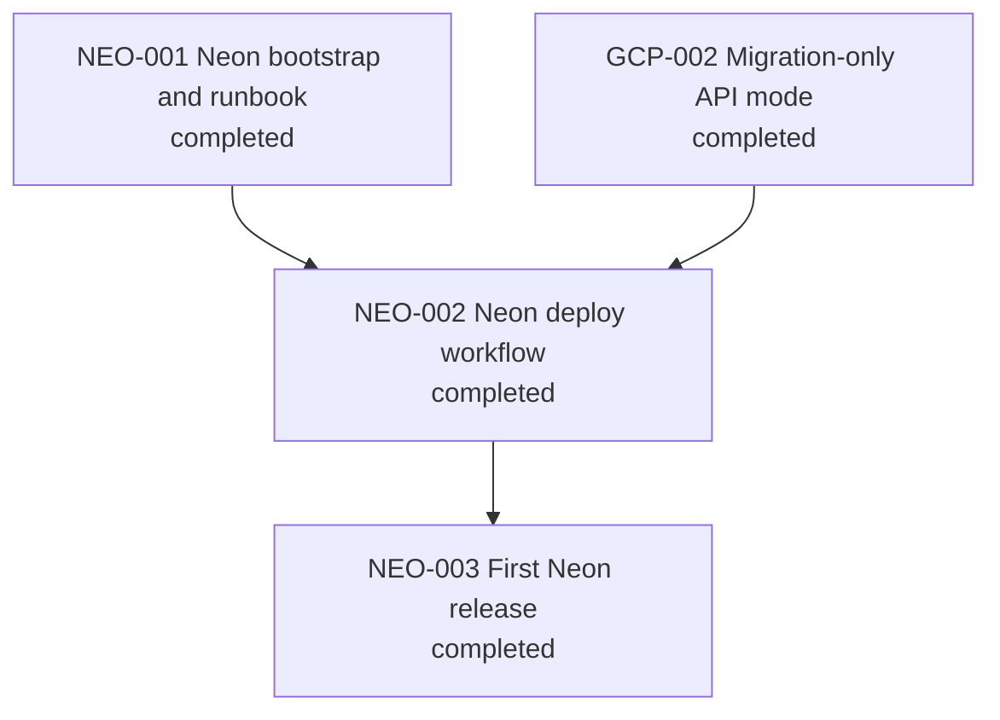
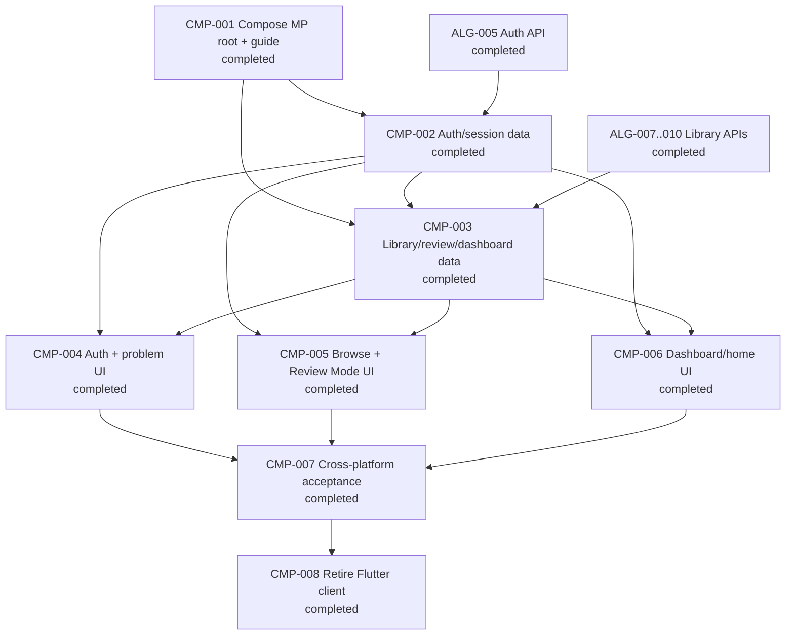
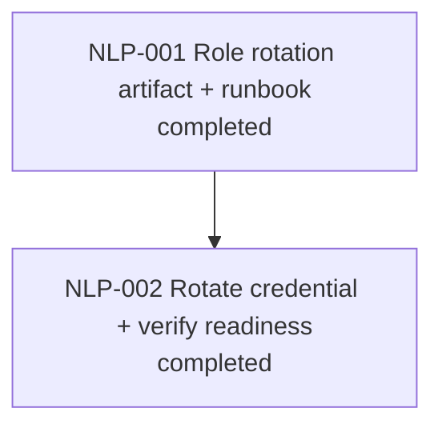
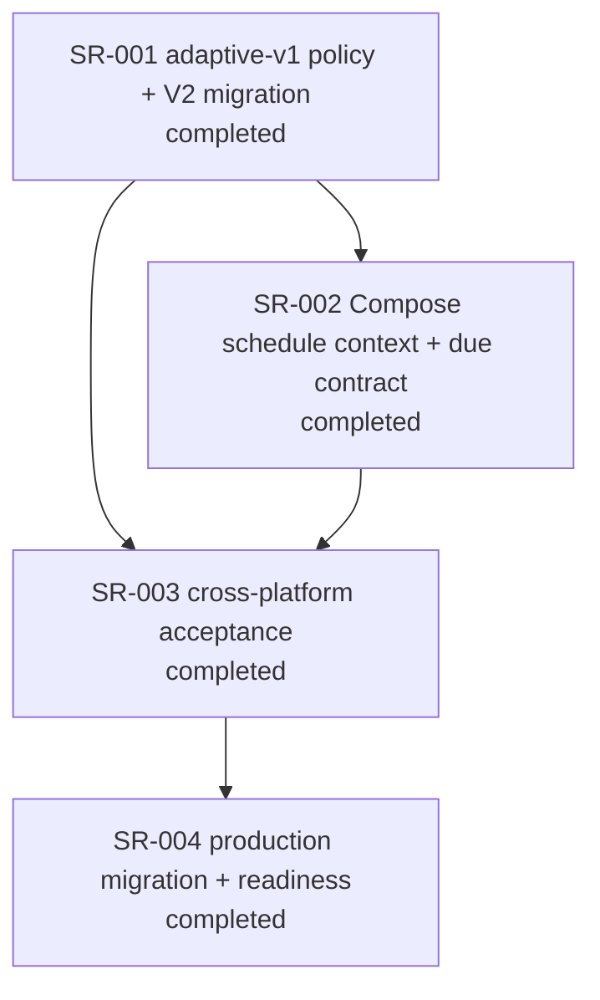
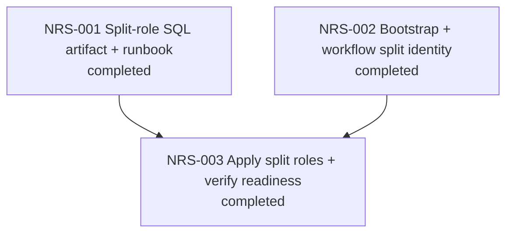
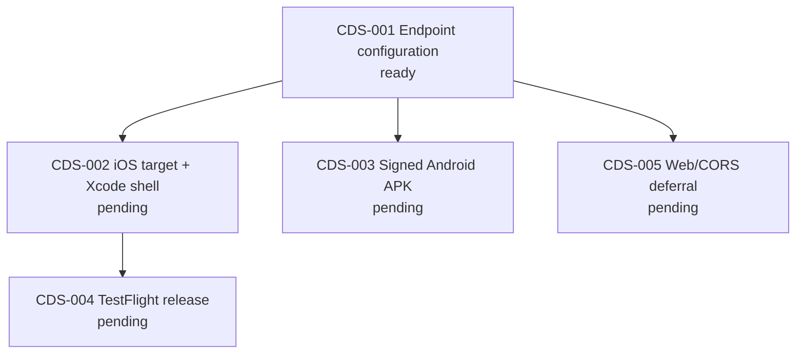

# Algorithm Learning Platform — Dependency Graph

Parallel groups are recorded in `WORK_GRAPH.yaml`; they are eligibility groups,
not authorization to begin a task without `$execution-strategy`.

# GCP Cloud Run Delivery — Dependency Graph

`GCP-001`, `GCP-002`, and `GCP-003` are completed. `GCP-004` is blocked: it is
superseded by the Neon delivery path below and must not run.

# Neon Cloud Run Delivery — Dependency Graph

# Compose Multiplatform Migration — Dependency Graph

# Neon Least-Privilege Role — Dependency Graph

# Spaced Repetition — Dependency Graph

# Neon Migration/Runtime Role Separation — Dependency Graph

`R1`, `R2`, and `R3` are completed. The runtime role is SQL-created (no
`neon_superuser`), the serialized release migrated once as
`algorithm_learning_migrate` and serves readiness as `algorithm_learning_app`,
and the operator's probe proves DDL is denied while DML succeeds.

# Client Distribution — Dependency Graph

The selected distribution contract is: dual endpoint configuration, direct
signed Android APK, operator-owned TestFlight external testing, and deferred
production Web/CORS. `CDS-001` is the only ready task.

Parallel groups are recorded in `WORK_GRAPH.yaml`; they are eligibility groups,
not authorization to begin a task without `$execution-strategy`.
