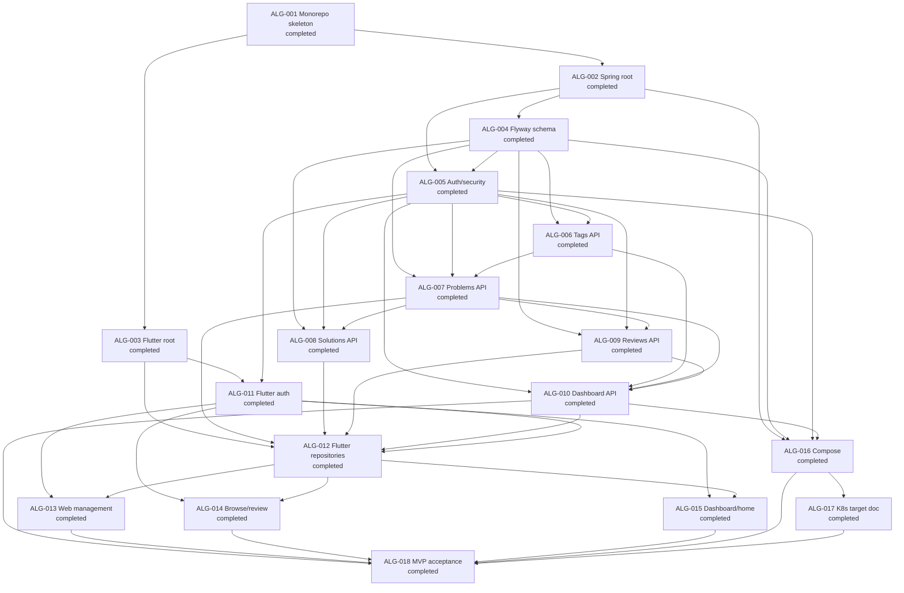
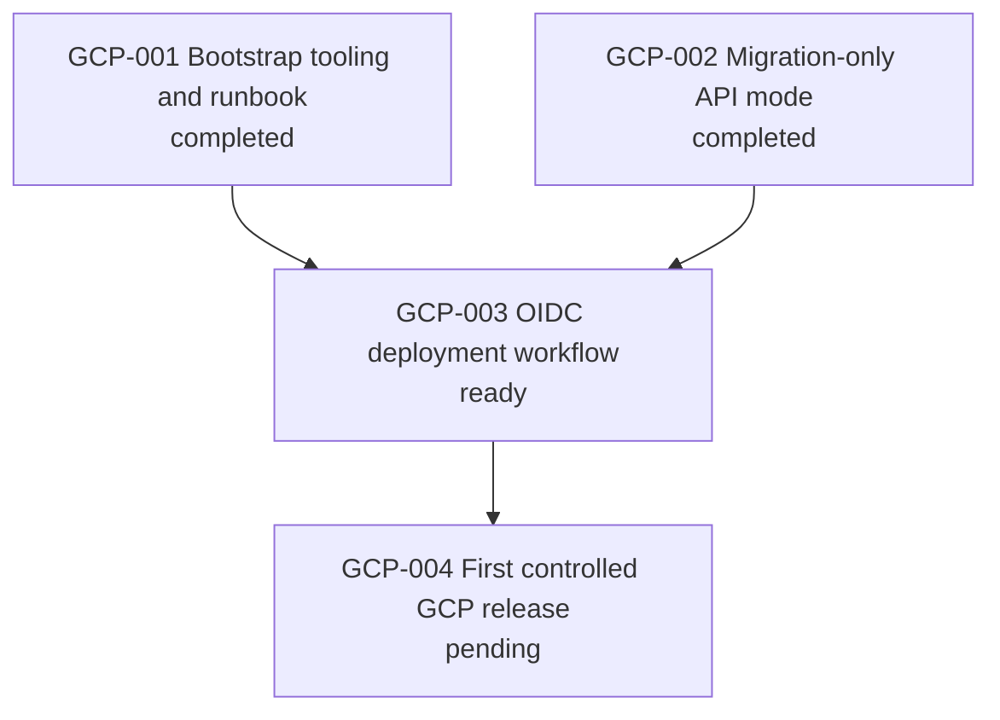

# Algorithm Learning Platform — Dependency Graph

Parallel groups are recorded in `WORK_GRAPH.yaml`; they are eligibility groups,
not authorization to begin a task without `$execution-strategy`.

# GCP Cloud Run Delivery — Dependency Graph

`GCP-001` and `GCP-002` are completed, so `GCP-003` is ready. `GCP-004` is the
sole GCP-mutating task and cannot begin before the bootstrap/workflow artifacts
are complete and the user has privately configured the approved GCP and GitHub
Environment values.
